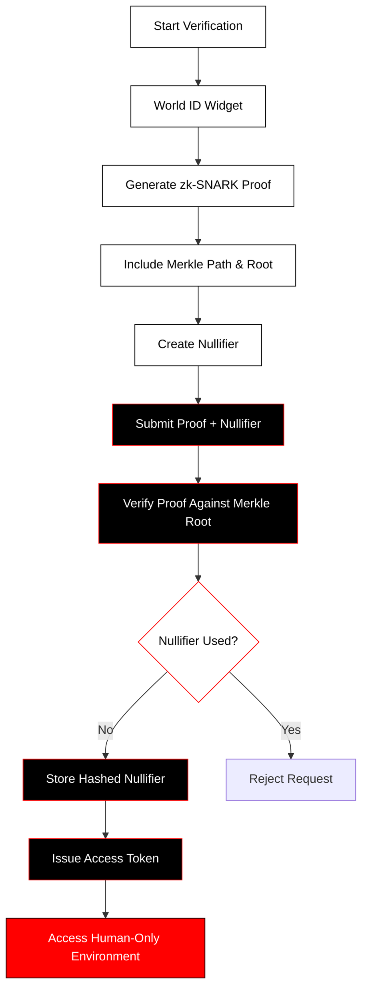

  

<h1 align="center">Hash Humanity</h1>

  <strong>Human-Verified Access Layer for the Modern Internet</strong> 
  Powered by World ID Zero Knowledge Proofs

  <em>White Paper – Version 1.1</em>

---

# Executive Summary

Hash Humanity is a privacy-preserving human verification layer designed to restore trust, authenticity, and integrity to digital interaction. The modern internet has lost the ability to reliably distinguish real human participants from automated agents, AI-generated personas, and synthetic identities. This failure has degraded online discourse, enabled large-scale manipulation, compromised governance systems, and eroded confidence in digital communities.

Existing solutions attempt to solve this problem by identifying users. Hash Humanity takes a fundamentally different approach. Instead of proving who a person is, Hash Humanity proves only that a participant is a unique real human being. This distinction allows platforms to enforce human authenticity without collecting, storing, or processing personal, biometric, or identity data.

Hash Humanity is not a blockchain, not a token, and not a new identity protocol. It is an application-layer access and verification system built on top of World ID’s zero-knowledge Proof of Personhood. Its purpose is to make cryptographic human verification usable, scalable, and privacy-preserving for real-world platforms.

---

# 1. The Problem

Digital systems today cannot reliably distinguish between humans and machines. Automated bots generate content, influence opinions, manipulate markets, and participate in governance systems at scale. AI models can now convincingly imitate human communication. Identity farms create thousands of synthetic accounts. Together, these forces undermine the foundational assumption that a digital participant represents a real person.

Traditional identity-based solutions attempt to address this by requiring government identification, biometric scanning, or centralized identity providers. While these methods can increase confidence in uniqueness, they introduce significant risks. They require users to surrender sensitive personal information, create centralized databases that become high-value attack targets, and enable surveillance, tracking, and long-term profiling.

The core issue is that digital platforms do not need identity. They need authenticity. They need to know that each participant represents a real, unique human being — nothing more.

---

# 2. Hash Humanity’s Approach

Hash Humanity provides a verification layer that allows a user to prove their humanity without revealing any personal information. The system integrates World ID’s zero-knowledge Proof of Personhood, enabling users to generate cryptographic proofs locally on their device. These proofs demonstrate membership in the global set of verified humans without disclosing identity, biometrics, or any identifying attributes.

Hash Humanity validates these proofs and issues short-lived access tokens that grant entry into human-verified environments. At no point does Hash Humanity store biometric data, identity attributes, or persistent user profiles. The system operates entirely on cryptographic assurance rather than trust in stored information.

This architecture enables platforms to build communities, governance systems, financial interactions, and communication environments that are provably human while remaining privacy-preserving.

---

# 3. Design Principles

Hash Humanity is built around strict architectural principles. The system minimizes data collection, minimizes trust requirements, and minimizes attack surfaces. All sensitive computation occurs on the user’s device. Backend services remain stateless and privacy-preserving. No persistent identifiers are created. No cross-session tracking is possible. Every interaction is independently verified through cryptographic proof.

The goal is not merely compliance with privacy regulations, but the elimination of privacy risk by design.

---

# 4. System Overview

When a user interacts with Hash Humanity, they authenticate using the World ID widget. This process produces a zero-knowledge proof on the user’s device. The proof demonstrates that the user is a member of the verified human set without revealing which member they are.

The proof is submitted to the Hash Humanity backend, where it is validated using Firebase Cloud Functions. The system checks proof integrity and verifies that the associated nullifier has not been previously used for the same action. If the proof is valid, the system issues a short-lived access token that allows the user to enter human-verified environments.

The backend stores only hashed nullifiers for replay protection. These hashes cannot be reverse-engineered or linked back to any individual.

---

# 5. Cryptographic Foundations

Hash Humanity relies on the Semaphore protocol provided by World ID. Semaphore combines zk-SNARKs, Merkle tree membership proofs, and nullifiers to enable anonymous yet verifiable participation.

The Merkle tree represents the global set of verified humans. Each user occupies a leaf in the tree. When a user generates a proof, they demonstrate membership in the tree without revealing their leaf position. This preserves anonymity while ensuring uniqueness.

Nullifiers prevent Sybil attacks. Each action produces a unique nullifier that cannot be reused. This ensures that one human cannot perform the same restricted action multiple times under different identities.

Because all cryptographic computation occurs locally, Hash Humanity never handles biometric data or identity attributes.

---

# Proof Generation Flow

;
6. Frontend Architecture
The frontend is built using React and Vite. These technologies were chosen for their performance, modularity, and compatibility with cryptographic workflows in the browser.

The frontend integrates the World ID widget, orchestrates proof generation, manages ephemeral session data, and communicates with backend validation services. No user accounts, passwords, or personal information are required. The user experience is intentionally simple: verify once and gain access.

Sensitive operations remain isolated to the client environment, ensuring that privacy boundaries are preserved.

7. Backend Architecture
The backend is implemented using Firebase and Cloudflare.

Firebase Cloud Functions validate proofs, verify nullifiers, and issue short-lived access tokens. Firestore stores only hashed nullifiers required to prevent replay attacks. Firebase Authentication provides token infrastructure without maintaining user identity.

Cloudflare provides global routing, DDoS protection, bot mitigation, and Web Application Firewall capabilities. Cloudflare Workers may perform edge validation and rate limiting to reduce backend load. Cloudflare WebRTC enables encrypted peer-to-peer audio communication.

This hybrid architecture ensures global scalability, resilience, and performance while maintaining strict privacy guarantees.

8. Voice Room
Voice Room is a real-time audio communication environment restricted to verified humans. It uses Cloudflare WebRTC to establish encrypted peer-to-peer audio channels between participants.

No audio is recorded, stored, or analyzed. The system exists solely as a human-verified communication layer. Communities can host discussions, debates, governance sessions, or social interactions without fear of bots, impersonators, or AI voices.

9. Pulse: Peer-to-Peer Crypto Transfers
Pulse enables direct crypto transfers between verified humans. Hash Humanity does not custody funds, store wallet addresses, or log transactions. Its role is limited to verifying that both participants are unique humans at the moment of interaction.

Transfers occur directly through the user’s chosen blockchain or wallet infrastructure. This creates a new trust primitive for decentralized finance, where authenticity is guaranteed without compromising privacy.

10. Security Model
Hash Humanity is designed around minimizing trust. There is no identity database to breach. There are no biometric records to steal. There are no user profiles to correlate.

All backend services are stateless. Nullifiers prevent replay attacks. Cloudflare protects against network-level abuse. The cryptographic guarantees of World ID ensure uniqueness without disclosure.

The system reduces risk by eliminating sensitive data entirely.

11. Privacy and Compliance
Hash Humanity is compliant with GDPR, CCPA, and global privacy regulations by design. Because no personal data is collected, stored, or processed, regulatory risk is inherently minimized.

Users cannot be tracked across sessions. No behavioral profiles can be constructed. No identity information exists within the system.

Privacy is not a policy. It is an architectural consequence.

12. Applications
Hash Humanity can be used for human-verified social platforms, governance voting systems, DAO participation, research studies, financial interaction gating, and AI-safe communication environments. Any system that requires authentic human participation without identity exposure can integrate Hash Humanity.

13. Roadmap
Hash Humanity begins as a centralized application layer built on Firebase. Future phases include federated verification endpoints, open-source validation libraries, and ultimately a decentralized verification network. Each phase reduces centralization while preserving cryptographic guarantees.

14. Governance
As the system matures, governance will transition toward transparent, auditable frameworks aligned with decentralization and community oversight.

15. License
Hash Humanity core components are released under the MIT License.

16. World App Mini-App Compatibility
Hash Humanity is designed to operate within WebView environments such as the World App Mini-App ecosystem. The system requires no persistent storage, no background processes, and no platform-specific dependencies, making it fully compatible with Mini-App constraints.

17. Philosophy
Humanity should be provable without being traceable.
Trust should be mathematical.
Identity should remain private.

Conclusion
Hash Humanity restores authenticity to digital interaction without creating a surveillance system. It proves humanity, not identity. It replaces trust with cryptography. It enables human-verified digital spaces at global scale.

<strong style="color:#ff0000;">Hash Humanity</strong> 
Privacy‑Preserving Human Verification for the Modern Internet 
Powered by World ID Zero‑Knowledge Proofs 
Built with React, Vite, Firebase, and Cloudflare

<em>© 2026 Hash Humanity — Privacy by Design</em>

